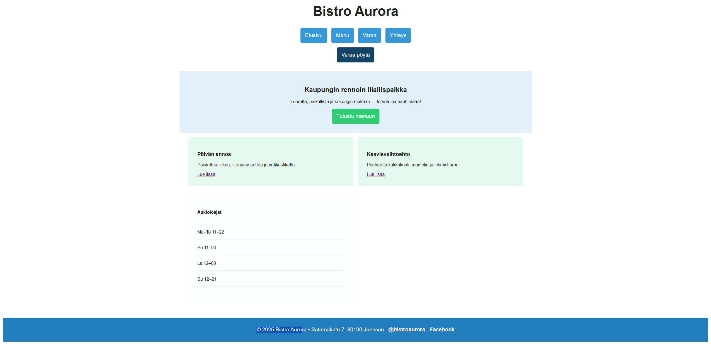

# Sass tehtävä

Käytin kaikkia Sass ominaisuuksia mitä näytettiin dioissa. Muuttujat, komponentit mixineissä, layoutissa kaikkien käyttö ja lopullisten tyylien osoittaminen html:ään. Style.scss importtina päätiedostoon. 

* Muuttujia, mittoja, operaattorit + funktiot (variables.scss)

* Mixin eri komponenteille. Näissä muuttujien käyttöä, funktioita, esim darken. mukana. Responsiivisuus 600px kohdalla. 

* Sisäkkäisiä valitsijoita + &-parentteja käytetty layout.scss, esim. btn -> sisäkkäiset valitsijat primary ja secondarylle. Näissä käytetyssä button-styles mixinissä käytetty & parenttia :hoverissa. 

## Kuva sivusta:

